### 说明

#### 注册
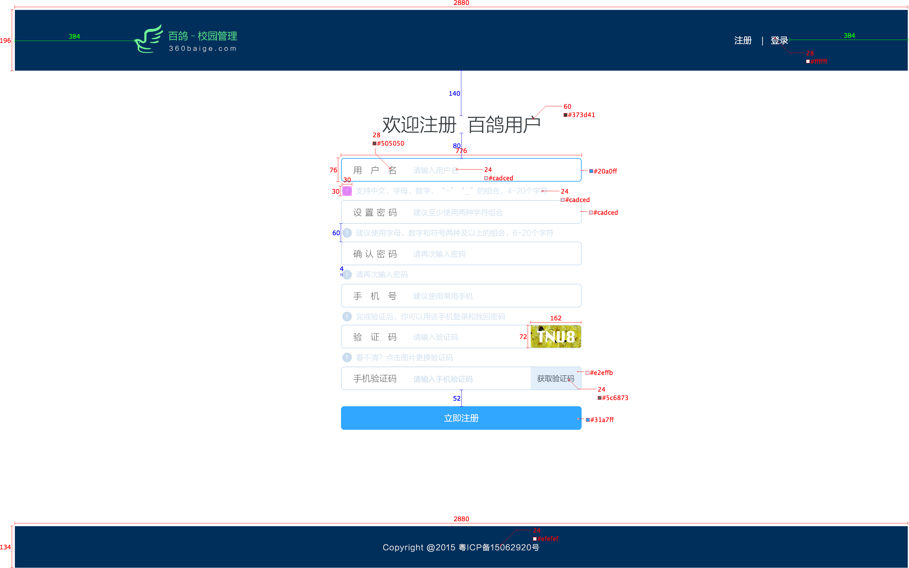

#### 登录
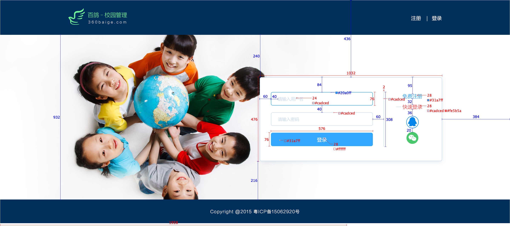

#### 应用中心（身份切换\用户信息）
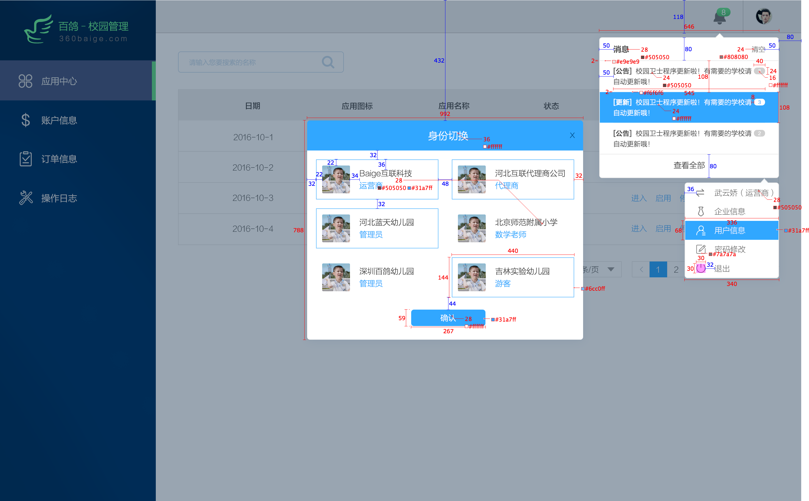

#### 应用中心
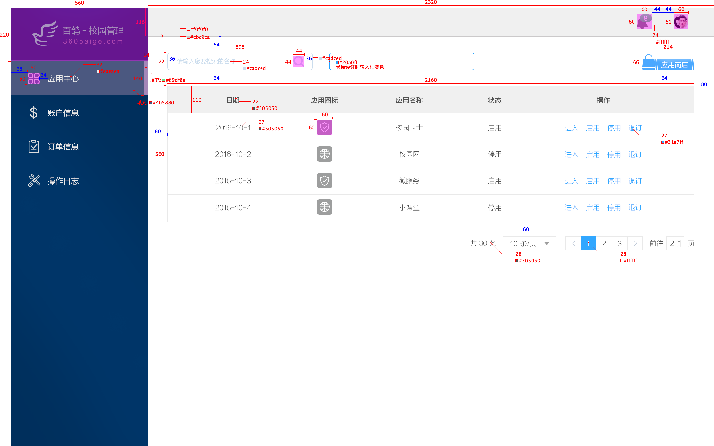

#### 应用商店
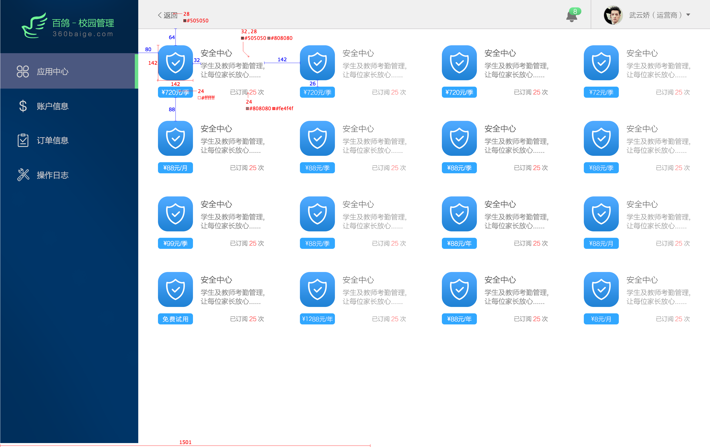

#### 下单
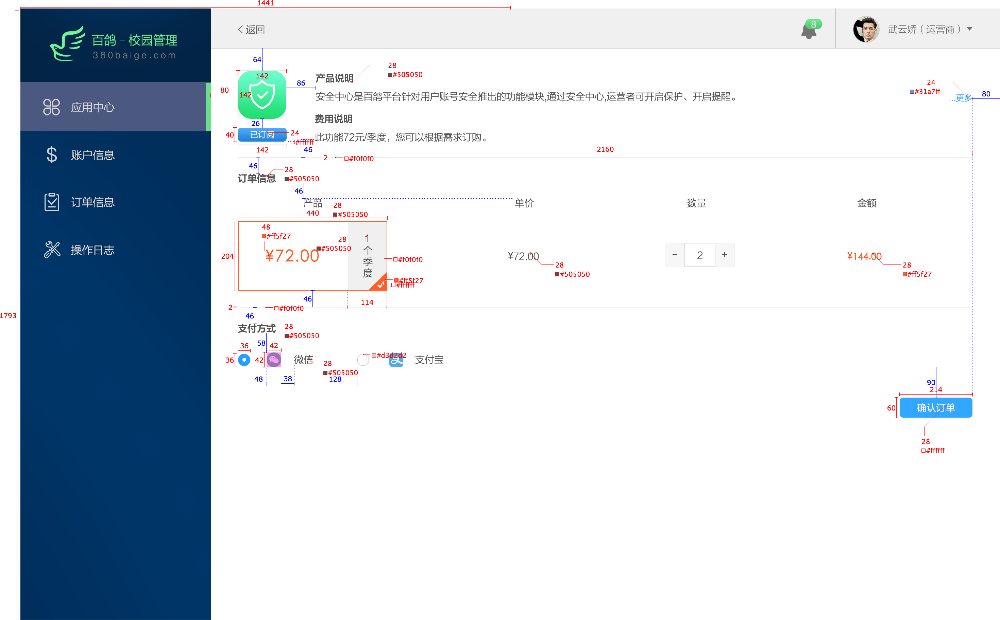

#### 付款
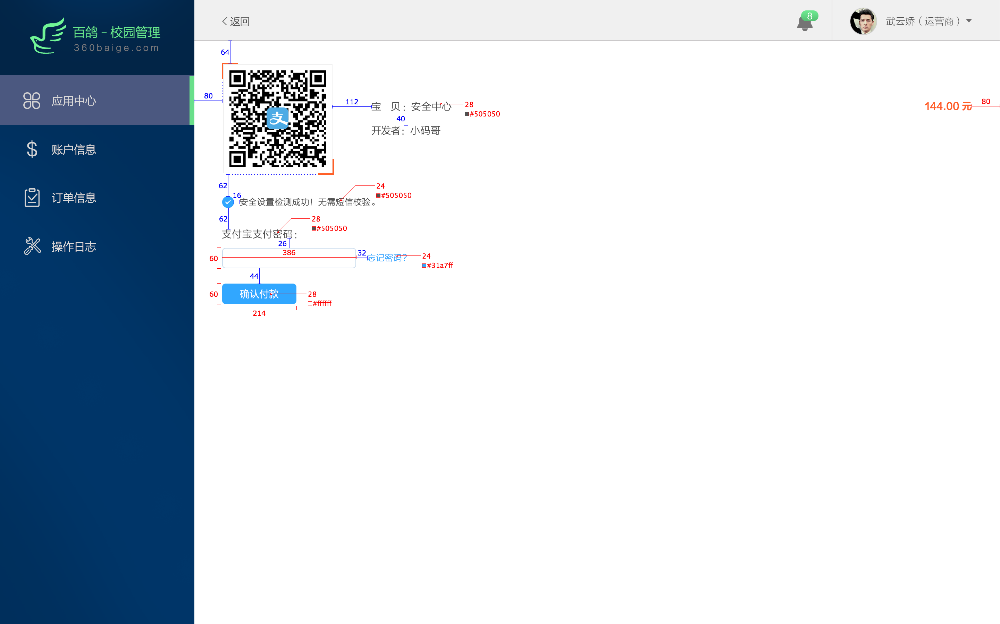

#### 订单详情
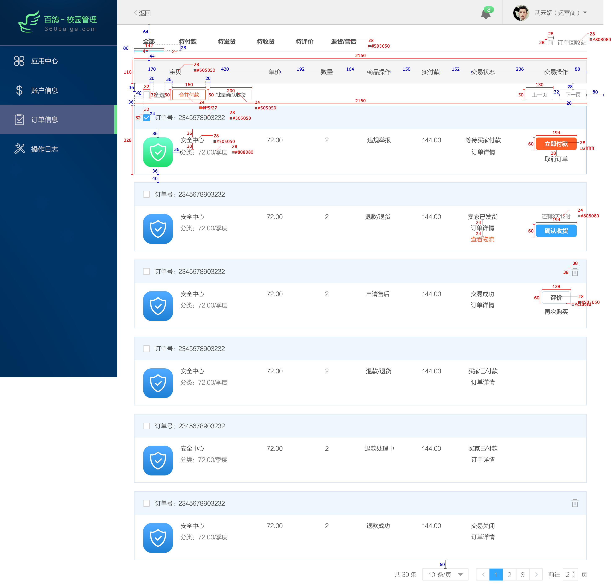

#### 评价
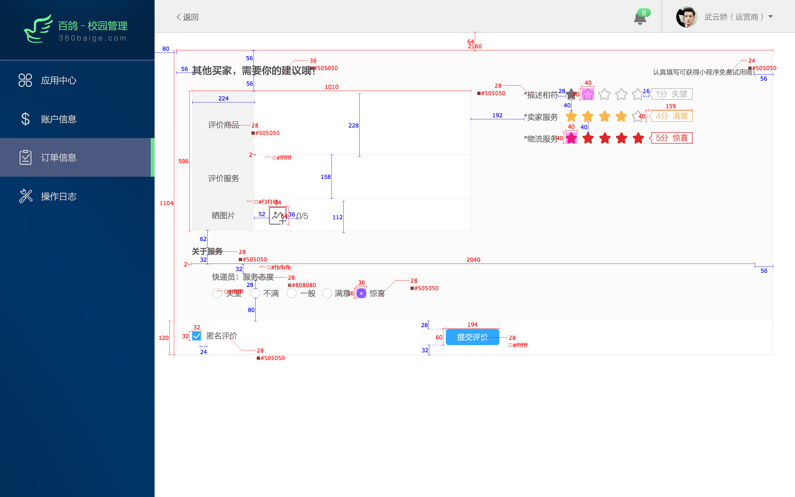

#### 物流
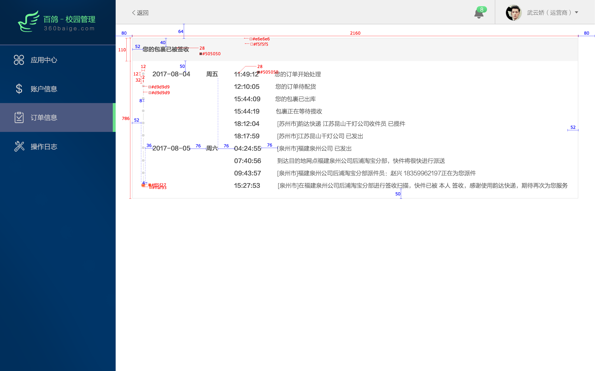

#### 出账记录
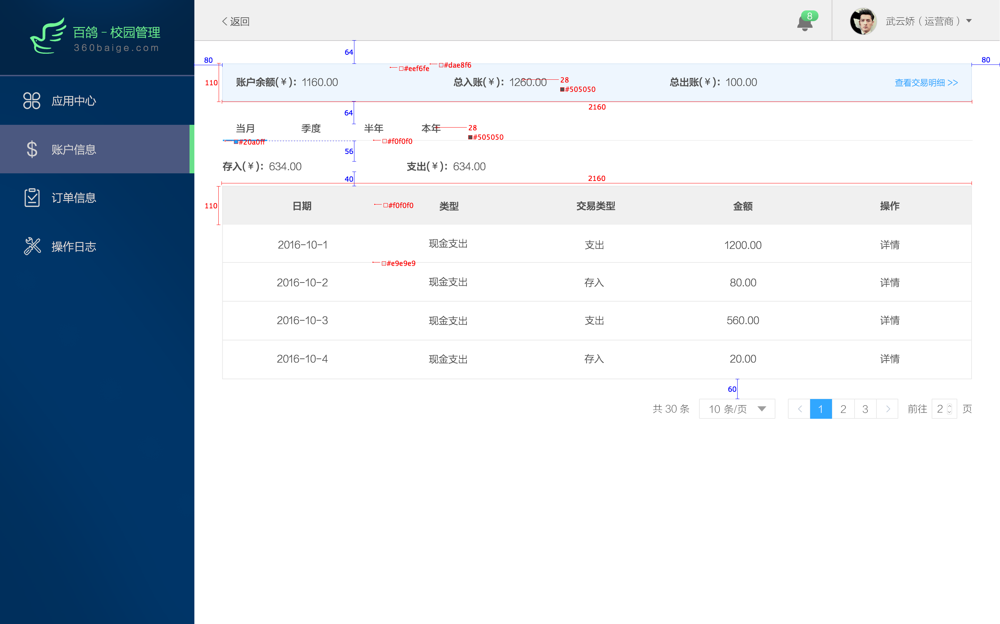

#### 交易明细
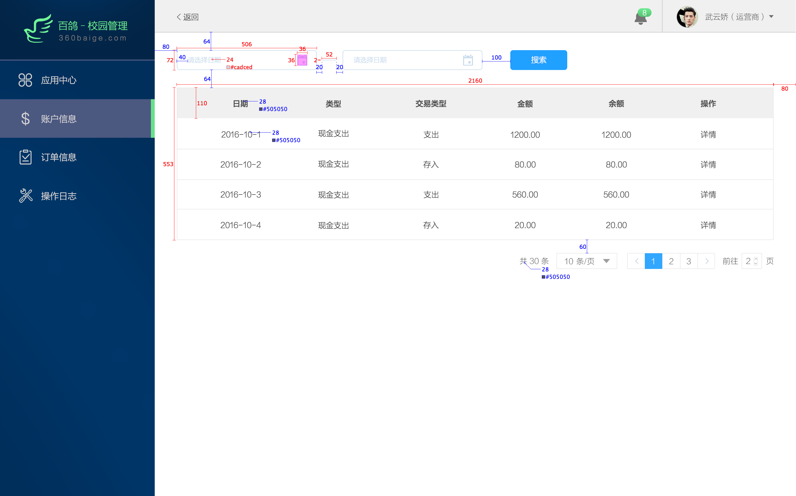

#### 交易详情
弹窗内容

#### 日志信息

#### 消息记录
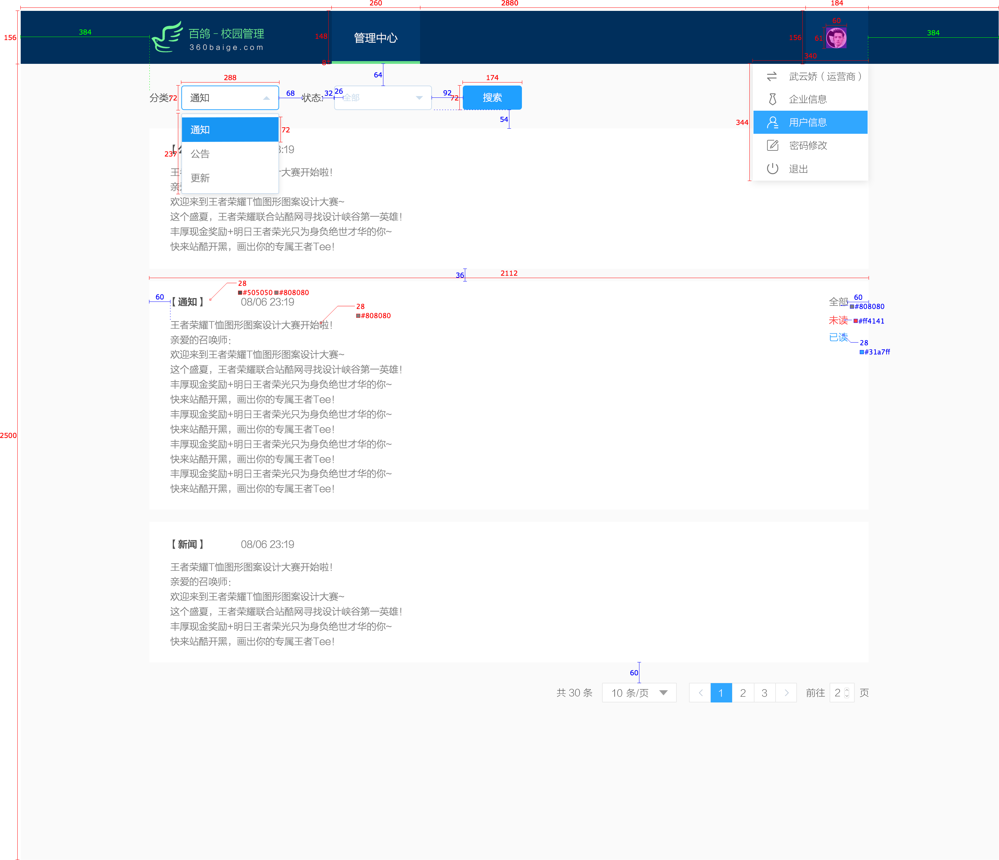

#### 消息详情 
弹窗内容

